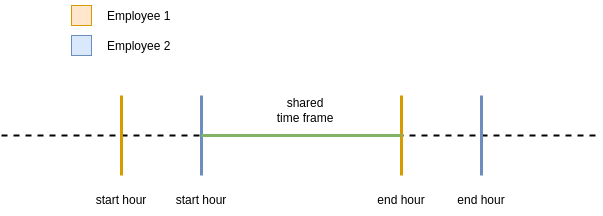
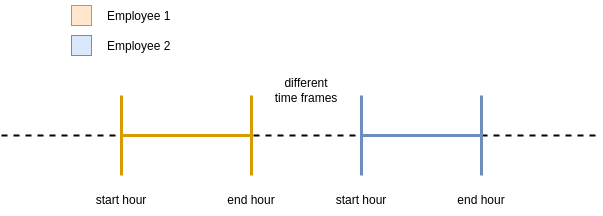

# ACME - TEST

## Overview

The solution is split between three files:

- main.py: main file to run the script
- workhour.py: file where the WorkHour class is
- test_workhour.py: test file of the WorkHour class and its methods

### WorkHour

The WorkHour class contains a constructor that takes a `workhour_string` as an argument and the employee's name (`employee_name`).

The `workhour_string` is handled to extract the employee's work day, start hour and end hour information.

Example: when receiving "MO10:15-12:00", the `day` property will receive `'MO'`, the `starthour` property will receive `1015` and the `endhour` property will receive `1200`.

The hour is converted to an int for easy time frame comparison.

For ease of comparison, I overridden the `__eq__` method so that I could compare time frames properly.
First, the day is checked, if it is the same day, it is passed on to the next checks, where the start and end hours of the compared objects are placed in ascending order. If the hours are in the following order `[starthour, starthour, endhour, endhour]` it means that the employees shared the same time frame in the office. If it results in `[starthour, endhour, starthour, endhour]` it means that the employees were not at the same time.

#### Shared time frames

`[starthour, starthour, endhour, endhour]`



#### Different time frames

`[starthour, endhour, starthour, endhour]`



The `get_relations` method takes care of the comparison between the object and the workhours inside a `workhour_list`, if other workhours are found that share the same time frame, a record is added in a `relations_dict` dictionary where the key has the format `EMPLOYEE_NAME-OTHER_EMPLOYEE_NAME` (Example: `ASTRID-RENE`) and the value is the counter of how many time franes these employees have shared in the office.

### Main

The main script reads the `input.txt` file inside the `resources` folder and iterates over its lines. For each line, the name of the employee and their "workhours" are separated, for each workhour a `WorkHour` object is created, then a search is made for other workhours in the `workhour_list` that have the same time frame and finally the object is added to the list.

After processing, the result is printed on the screen.

### TestWorkHour

The test script performs 9 tests of the following categories: test to validate that the properties are getting the correct values ​​from the `workhour_string`, test to compare time frames and finally tests of the `get_relations` method.

To name the tests, the nomenclature chosen was:

- test_should_expected_behavior_when_state_under_test

#### Tests:

- test_should_assign_the_right_values_to_properties_when_passed_the_workhours_string
- test_should_return_true_when_compared_different_workhours_with_same_day_and_same_starthour_and_endhour
- test_should_return_true_when_compared_different_workhours_with_same_day_and_different_starthour_but_same_endhour
- test_should_return_true_when_compared_different_workhours_with_same_day_and_same_starthour_but_different_endhour
- test_should_return_true_when_compared_different_workhours_with_same_day_and_different_starthour_and_endhour_but_worked_one_hour_together
- test_should_return_false_when_compared_different_workhours_with_different_days
- test_should_return_false_when_compared_different_workhours_with_same_day_but_different_work_time
- test_should_fill_the_relations_dict_with_one_relation_when_passes_a_workhour_list_with_one_same_workhour
- test_should_fill_the_relations_dict_with_two_relations_when_passes_a_workhour_list_with_two_same_workhours

## Architecture

Due to the simplicity of the solution, it was not necessary to use a very complex architecture. Where it was only necessary to create a class, a main function and a test function.

Due to the language, [PEP-8](https://peps.python.org/pep-0008/) recommendations were used for code formatting. And from the SOLID methodology, the S principle of Single Responsibility Principle was applied to create functions, classes and methods.

## How to run?

1) Clone the repository

```bash
reihtw@localhost:~$ git clone http://github.com/reihtw/acme-test.git 
```

2) Change to `acme-test/src` directory:

```bash
reihtw@localhost:~$ cd acme-test/src
```

3) Run it!

```bash
reihtw@localhost:~/acme-test/src$ python3 main.py 
```

* If you use Windows:

```powershell
PS C:\Users\Reihtw\Desktop\acme-test\src> py.exe main.py
```